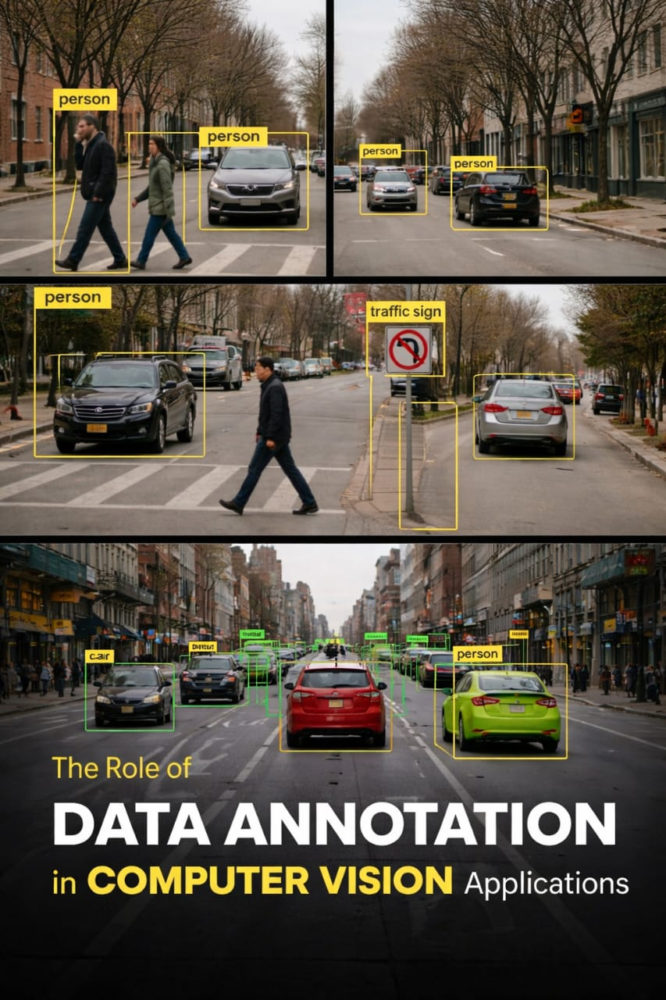

#  AI Data Annotation Project

##  Overview
This project demonstrates the process of data annotation for computer vision, where raw images are labeled to make them usable for machine learning models. The goal is to transform unstructured visual data into structured datasets that AI systems can understand and learn from.

##  Project Objective
- Annotate real-world images with relevant labels  
- Identify and classify objects such as cars, pedestrians, and traffic signs  
- Prepare high-quality datasets for training computer vision models  

##  Sample Output

The project includes annotated street scenes using bounding boxes:
- Objects are clearly labeled (e.g., person, car, traffic sign)  
- Bounding boxes highlight areas of interest  
- Multiple scenarios improve model generalization  

##  Tools & Techniques
- Bounding Box Annotation  
- Image Labeling  
- Computer Vision Concepts  
- Dataset Preparation  

##  Key Features
- Accurate object detection labeling  
- Consistent annotation across multiple images  
- Real-world scenario representation  
- Clean and structured dataset output  

##  Applications
This type of data annotation is widely used in:
- Autonomous driving systems  
- Traffic monitoring and control  
- Surveillance and security systems  
- Smart city solutions  

## What I Learned
- Importance of data quality in AI models  
- Attention to detail in labeling tasks  
- How annotated data improves model accuracy

##  Conclusion
This project highlights the critical role of data annotation in building reliable AI systems. High-quality labeled data directly impacts the performance and accuracy of machine learning model
- Real-world application of computer vision  

## 📂 Project Structure
